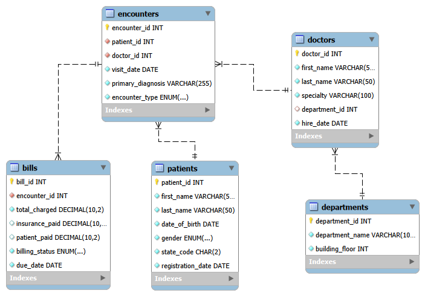

# 🏥 Healthcare Analytics Platform
 
This project was built to solve a very real problem: how to take messy clinical data and turn it into clear, actionable insights for hospital administrators. Whether you are trying to track down unpaid bills, look at patient demographics, or see which department is bringing in the most revenue, this database schema has you covered.

It is designed for **MySQL Workbench** using the reliable **InnoDB** engine.

---

## 🛠️ What’s Inside?

The system is split into five core areas that map out how a real hospital functions:

* **Departments:** The physical rooms and units (e.g., Cardiology on Floor 3).
* **Doctors:** Provider profiles, their specialties, and where they work.
* **Patients:** Master records covering basic demographics and registration dates.
* **Encounters:** Every single patient visit, along with the diagnosis and type of visit (ER, Inpatient, Outpatient).
* **Bills:** The financial layer—tracking what was charged, what insurance covered, what the patient paid, and what's still owed.

### How the Data Connects
* **Departments ➔ Doctors:** One department can host many doctors.
* **Patients & Doctors ➔ Encounters:** Every clinical visit links one patient to one treating doctor.
* **Encounters ➔ Bills:** A strict 1-to-1 relationship ensures every medical visit has exactly one financial statement attached to it.
Schema/schema.png

---

## 💻 Practical Data Tasks & Solutions

Here are the exact SQL queries I wrote to answer everyday questions an analytics team would face.

### 1. Patient Demographics
* **Goal:** Find all female patients born before the year 2000.
```sql
SELECT 
    patient_id, 
    first_name, 
    last_name, 
    date_of_birth, 
    gender 
FROM Patients
WHERE gender = 'Female' 
  AND date_of_birth < '2000-01-01';
```

### 2. High-Value Encounters
* **Goal:** Filter out any hospital visits that cost more than \$500.
```sql
SELECT 
    e.encounter_id, 
    e.patient_id, 
    e.visit_date, 
    b.total_charged 
FROM Encounters e
INNER JOIN Bills b ON e.encounter_id = b.encounter_id
WHERE b.total_charged > 500.00;
```

### 3. Revenue Leakage
* **Goal:** Calculate exactly how much money is sitting in "Unpaid" or "Partially Paid" bills.
```sql
SELECT 
    bill_id,
    encounter_id,
    total_charged,
    insurance_paid,
    patient_paid,
    (total_charged - insurance_paid - patient_paid) AS remaining_balance,
    billing_status
FROM Bills
WHERE billing_status IN ('Unpaid', 'Partially Paid');
```

### 4. Doctor-Department Mapping
* **Goal:** Create a simple directory matching doctors to their actual department names.
```sql
SELECT 
    d.doctor_id,
    d.first_name,
    d.last_name,
    d.specialty,
    dept.department_name
FROM Doctors d
INNER JOIN Departments dept ON d.department_id = dept.department_id;
```

### 5. Executive Summary Metrics
* **Goal:** Get a quick high-level view of all money charged, insurance collections, and cash paid by patients.
```sql
SELECT 
    SUM(total_charged) AS total_revenue_charged,
    SUM(insurance_paid) AS total_insurance_collected,
    SUM(patient_paid) AS total_patient_collections
FROM Bills;
```

### 6. Volume by Encounter Type
* **Goal:** Find out where the hospital is the busiest (Inpatient, Outpatient, or the ER).
```sql
SELECT 
    encounter_type, 
    COUNT(encounter_id) AS visit_count
FROM Encounters
GROUP BY encounter_type
ORDER BY visit_count DESC;
```

### 7. Patient Journey Tracking
* **Goal:** Build a chronological timeline showing patient names, their visit dates, who they saw, and what they were diagnosed with.
```sql
SELECT 
    CONCAT(p.first_name, ' ', p.last_name) AS patient_full_name,
    e.visit_date,
    d.last_name AS doctor_last_name,
    e.primary_diagnosis
FROM Encounters e
INNER JOIN Patients p ON e.patient_id = p.patient_id
INNER JOIN Doctors d ON e.doctor_id = d.doctor_id
ORDER BY e.visit_date DESC;
```

### 8. Highest Performing Department
* **Goal:** Identify which department is generating the most revenue for the hospital.
```sql
SELECT 
    dept.department_name,
    SUM(b.total_charged) AS total_billing_charges
FROM Bills b
INNER JOIN Encounters e ON b.encounter_id = e.encounter_id
INNER JOIN Doctors d ON e.doctor_id = d.doctor_id
INNER JOIN Departments dept ON d.department_id = dept.department_id
GROUP BY dept.department_id, dept.department_name
ORDER BY total_billing_charges DESC
LIMIT 1;
```

### 9. Chronic Condition Tracking
* **Goal:** Run a quick search to find any patient who has been diagnosed with "Hypertension".
```sql
SELECT DISTINCT 
    p.patient_id,
    p.first_name,
    p.last_name,
    e.primary_diagnosis
FROM Patients p
INNER JOIN Encounters e ON p.patient_id = e.patient_id
WHERE e.primary_diagnosis LIKE '%Hypertension%';
```

### 10. Busy Providers
* **Goal:** Find our high-performing doctors who have handled more than one patient encounter.
```sql
SELECT 
    d.doctor_id,
    d.first_name,
    d.last_name,
    COUNT(e.encounter_id) AS encounter_count
FROM Doctors d
INNER JOIN Encounters e ON d.doctor_id = e.doctor_id
GROUP BY d.doctor_id, d.first_name, d.last_name
HAVING COUNT(e.encounter_id) > 1
ORDER BY encounter_count DESC;
```

